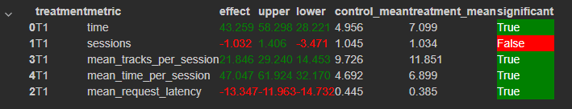

Старая версия README.md теперь лежит [вот здесь](README_OLD.md)

# Домашнее задание
Описание ДЗ лежит [по этой гиперссылке](slides/week03/homework.md)

# 1) Отчёт
### i. Основная идея эксперимента
Лучше использовать то, что имеем - надёжность в простоте. Нужно победить нейросетевой рекоммендер, тогда просто модифицируем его таким образом, чтобы улучшить его результат.

Итоговая идея: если нам попался трек, который пользователю не понравился, то зачем следующим рекомендовать похожий на него? 
Лучше рекомендовать по похожим трекам, которые пользователю понравились.

Я пробовал много реализаций, но в итоге лучше всего подошло запоминание треков, которые пользователь прослушивал в течение дня. 
Нужный трек выбирается на умном рандоме - если первый трек нравится больше второго, то первый будет предпочтительней.
Веса расставляются соразмерно процентам прослушанного времени - если у первого трека reward 0.3, а у второго 0.1, то вероятность выбрать первый трек в 3 раза больше, чем вероятность выбрать второй трек.
Как только рандом выбрал подходящий трек, то мы повторяем реализацию нейросетевого рекоммендера - возвращаем случайную рекомендацию для этого трека из tracks_with_recs.json

### ii. Детали:
Для реализации используем глобальную для класса переменную - users. В ней будет находиться словарь: ключ - user, значение - массив прослушанных треков и их ревардов.
Так как невозможно определить (внутри класса рекомендации трека) начался новый день или нет, то просто будем смотреть на ревард - если равен 1, то очень вероятно, что этот пользователь только что начал сессию - тогда мы заново начинаем накапливать данные для этого пользователя в новый день.

### iii. Результаты

# 2) Инструкция
Всё так же, как на семинарах. Ничего нового не добавлено.

- [Запуск докера](botify/README.md)
- [Запуск симулятора](sim/README.md)